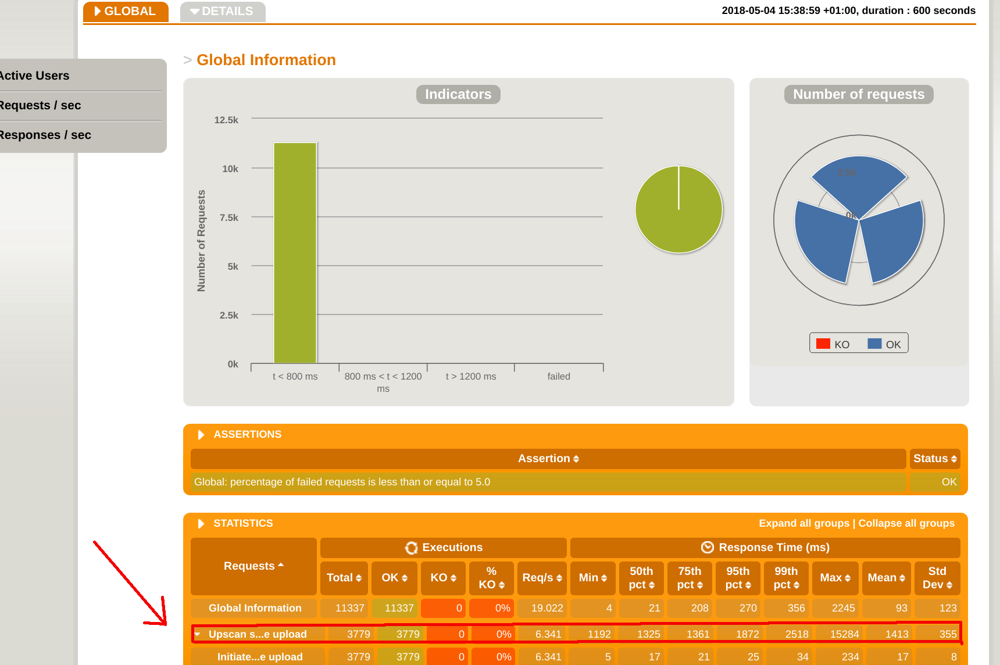

# upscan-performance-tests

The repository contains performance tests of upscan service.

Detailed information about upscan can be found here : https://github.com/hmrc/upscan-initiate/blob/master/README.md

The test is build around one scenario of uploading and scanning the file. The scenario consists of the following steps:

* Initiation of the file upload (call to the upscan-initate service)
* Uploading the file (call to AWS S3)
* Waiting for the file to be processed (periodic polling of upscan-listener utility service - these HTTP calls are not
shown on the report)
* Verifying if the file has been processed in certain time (less than 90s by default)

# How to run the test

The test can be run from performance Jenkins (job: `upscan-performance-tests`) which runs against the staging environment.
It can also be kicked-off locally via `run_staging.sh`
It is possible to run tests against another environment by changing the `baseUrl` as follows:
```
sbt '; clean; set javaOptions += "-DbaseUrl=https://www.{environmentName}.tax.service.gov.uk"; gatling:test'
```

# Interpretation of test results

Upscan service is processing uploaded files asynchonously, which means that response times for individual requests
are not good indicators of service's performance. For most of the time the test scenarios are pausing in order to
poll for updated status of the file, and actual polling is relatively quick.
Because of that the most useful metric that tells how the service perform is end-to-end file processing time, which includes
period between initiation of the upload and successful retrieval of the notification.
End-to-end processing time can be found in Gatling report as a 'Upscan successful file upload' row in 'STATISTICS' section.
Response times in this row are actually end-to-end processing times.



More detailed information about end-to-end processing time can be found in 'Details' section of the report that can be found
after clicking on 'Details' and scrolling down to 'Group duration percentiles over Time' and 'Group duration distribution' charts.

There are other resources that allow to better understand performance of the service:

* Amount of awaiting messages in inbound/outbound SQS queues on AWS
* Aggregated metrics of upscan on Grafana (dasboard name: upscan)
* Metrics of individual upscan services on Grafana (dashboards: upscan-initiate/upscan-verify/upscan-notify/upscan-listener)

### License

This code is open source software licensed under the [Apache 2.0 License]("http://www.apache.org/licenses/LICENSE-2.0.html").
